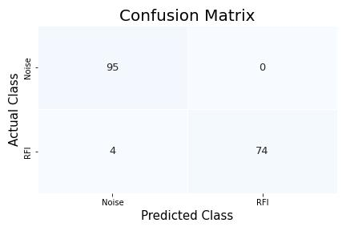

# Using a CNN to Classify Cyclostationary Data

Contributors: <a href= "https://github.com/mtgilley">Matthew Gilley</a>,<a href= "https://github.com/John-Morgan11"> John Morgan</a>, and <a href="https://github.com/Nicolasnulland">Nicolas Null</a>
 
Mentor: <a href="https://www.linkedin.com/in/sanishrai/">Dr. Sanish Rai</a>
 
Original data provided by <a href="https://www.linkedin.com/in/ryan-lynch-82992179/">Dr. Ryan Lynch</a>. The data was taken at the <a href="https://greenbankobservatory.org/">Green Bank Observatory</a> on the GBT.

## Overview
The goal of this project is to prove that AI can accurately label cyclostationary plots. This work is largely a proof of concept/getting the ball rolling on a larger project being worked on by Dr. Ryan Lynch. The end goal being a real time system that can filter out RFI (Radio Frequency Interference) from data being collected from radio telescopes. We have broken our code into 3 separate jupyter notebooks. We have also included folders to store outputs, and the screenshots themselves.

## Flow
If you are starting with the original images, you will have to run them through the crops_notebook to crop them to the correct size. After you have obtained cropped images (either by running the originals through the crops_notebook or starting with cropped images), you must load the images into dataloaders. This is done in the load_images notebook. Finally, to create, train and test the CNN on your images, run the creating_and_training_network notebook. The results of your run will be in the outputs of the notebook as well as saved in the output_files folder.

## Our Results
Originally, when training with all of the screenshots, the ration of noise to rfi was so high that our model was only predicting noise and still getting about a 93% accuracy. Once we unbiased the data, we were able to see results averaging in the high 90%. We were able to get a highly accurate model that only made 4 incorrect predictions. This yielded an accuracy score of 0.976878612716763 (almost 98% accurate) and the below confusion matrix.

## External Resources
We plan on publishing a paper on this project. If we are successful, we will post the link here. We will also publish the screenshots we used. Once that is accomplished, we will include the information here.

## Additional Thanks
We would like to thank the <a href="https://first2network.org/">First2Network</a> for helping label the cyclostationary data. We would also like to thank <a href="https://www.xsede.org/">XSEDE Empower</a> for helping fund our research.

## Dependencies and Imports
Our code uses the following libraries that must be installed:
<li><a href="https://pytorch.org/">pytorch</a> (for CNN architecture)</li>
<li><a href="https://scikit-learn.org/stable/">scikit-learn</a> (for result metrics)</a></li>
<li><a href="https://docs.python.org/3/library/pickle.html#:~:text=%E2%80%9CPickling%E2%80%9D%20is%20the%20process%20whereby,back%20into%20an%20object%20hierarchy.">Pickle</a> (for dumping models/dataloaders into hardrive)</li>
<li><a href="https://numpy.org/">Numpy</a> (optimized arrays)</li>
<li><a href="https://matplotlib.org/">Matplotlib</a> (visualization tool for confusion matrix)</li>
<li><a href="https://seaborn.pydata.org/">Seaborn</a> (visualization tool for confusion matrix)</li>

## Using the Code
You may use, modify and distribute any part of this code for another project or even in assistance to understanding the basic fundamentals of CNN's. We would be thrilled if our code was able to help someone learn or accomplish something awesome with our code. If you do use our work, we would appreciate a simple citation or just a link to this repository or to all three of the contributor's github repositories. Thank you!
